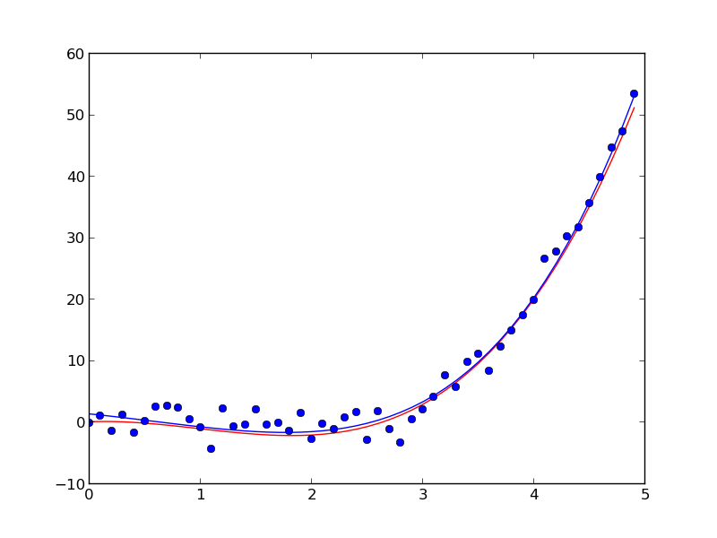
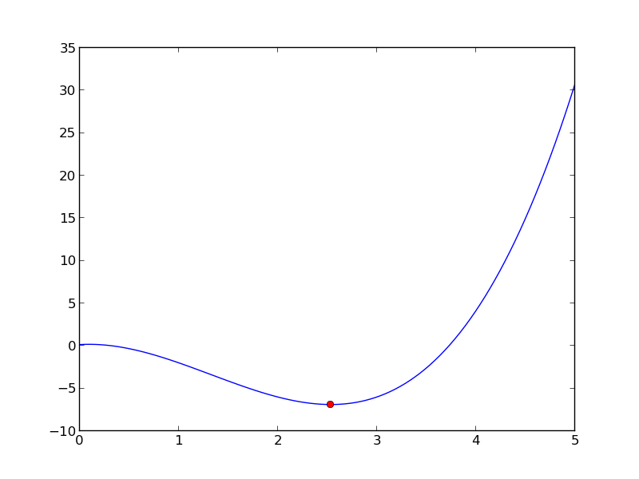
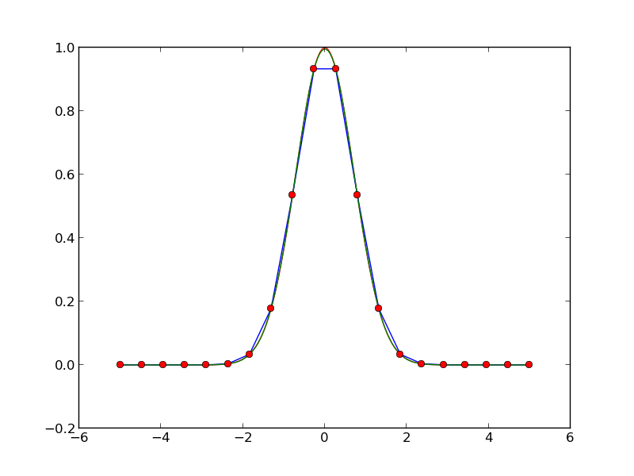
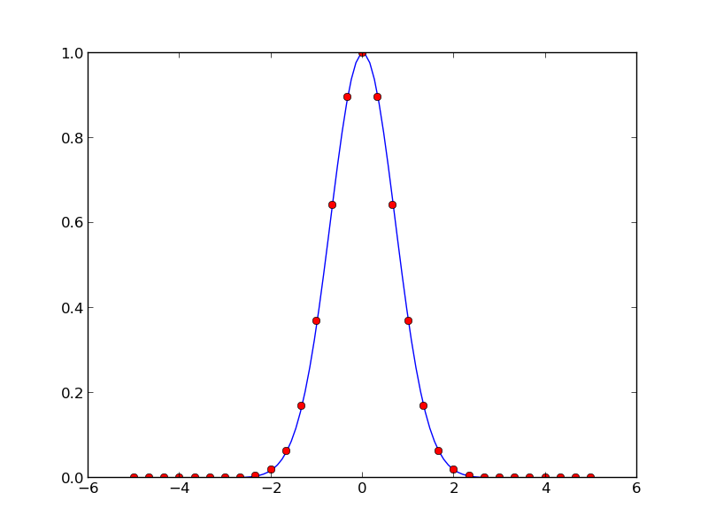

.. role:: cover

=========================================
:cover:`Numerical and Scientific Python`
=========================================

.. class:: cover

    ::

        Jonas Juselius <jonas.juselius@uit.no>
    
        HPC@UiT

.. raw:: pdf

   Transition Dissolve 1
   SetPageCounter 0
   PageBreak oneColumn

Least squares fit
----------------------------------------------------------------------
.. code-block:: python
    :linenos:
    :include: least_square.py

Least squares fit
----------------------------------------------------------------------

Minimization
----------------------------------------------------------------------
.. code-block:: python
    :linenos:
    :include: minimize.py

Minimization
----------------------------------------------------------------------

Interpolation
----------------------------------------------------------------------
.. code-block:: python
    :linenos:
    :include: interpolate.py

Interpolation
----------------------------------------------------------------------

Numerical integration
----------------------------------------------------------------------
.. code-block:: python
    :linenos:
    :include: quadrature.py

Numerical integration
----------------------------------------------------------------------

Vectorize
----------------------------------------------------------------------
.. code-block:: python
    :linenos:
    :include: vectorize.py

Arrays
----------------------------------------------------------------------
.. code-block:: python
    :linenos:
    :include: array.py

Random numbers
----------------------------------------------------------------------
.. code-block:: python
    :linenos:
    :include: random_numbers.py

Opetations on arrays
----------------------------------------------------------------------
.. code-block:: python
    :linenos:
    :include: operators.py

Masked arrays
----------------------------------------------------------------------
.. code-block:: python
    :linenos:
    :include: mask.py

Linear algebra
----------------------------------------------------------------------
.. code-block:: python
    :linenos:
    :include: linalg.py

